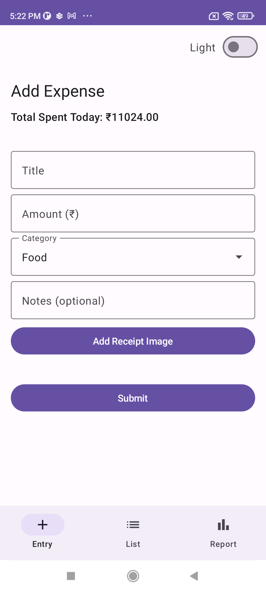
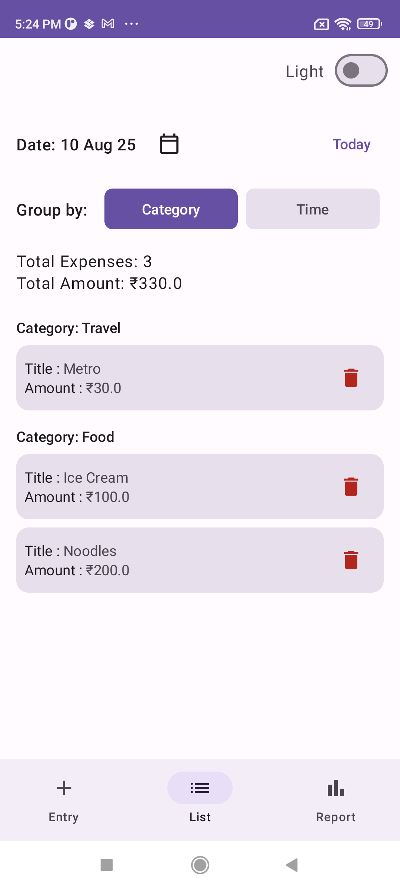
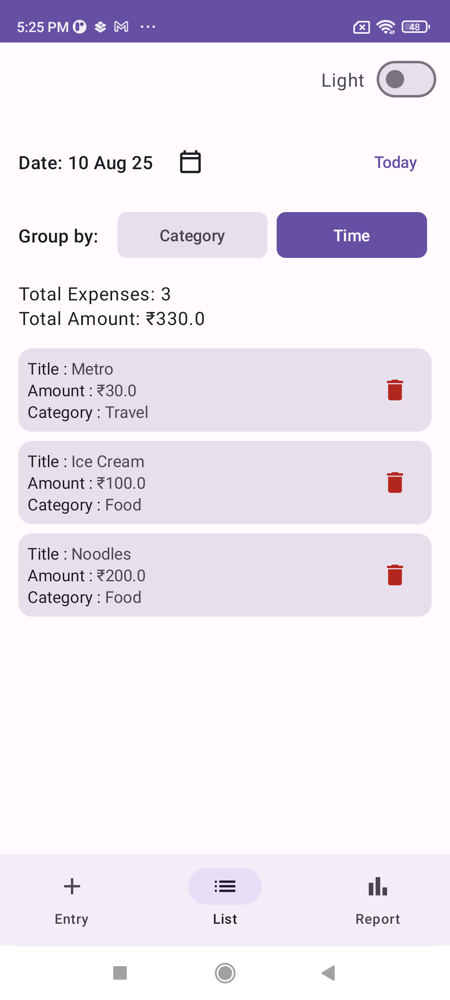
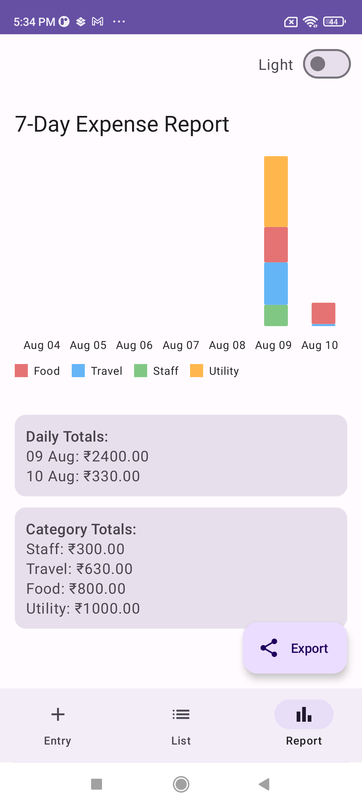
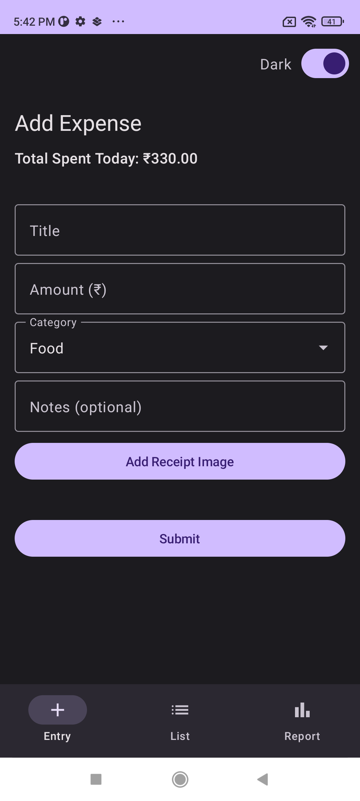

# 📱 Smart Daily Expense Tracker

A full-featured **Smart Daily Expense Tracker** Android application built with **Jetpack Compose** and **MVVM architecture**, designed for small business owners to easily record, view, and analyze daily expenses.

This project was developed as part of the *Smart Daily Expense Tracker — Full Module Assignment (AI-First)*, with added enhancements beyond the base requirements.

---

## ✨ Features

### Core Requirements
1. **Expense Entry Screen**
    - Fields: Title, Amount (₹), Category, Optional Notes (max 100 chars), Optional Receipt Image (mocked)
    - Submit button with toast confirmation and animated entry
    - Real-time "Total Spent Today" at the top

2. **Expense List Screen**
    - View expenses for **Today** (default) or previous dates via calendar/filter
    - Group by **Category** or **Time**
    - Displays total count, total amount, and empty state

3. **Expense Report Screen**
    - Mock report for the last 7 days
    - Daily totals and category-wise totals
    - Mocked bar/line chart
    - Optional export simulation (PDF/CSV) and share intent

---

## 🆕 Additional Enhancements
- **Bottom Navigation Bar** for quick switching between screens
- **Theme Switcher** (Light/Dark mode toggle)
- **Persistent Data Storage** using **Room**
- **Smooth Animation on Expense Add**
- **Validation** for expense entries
- **Reusable UI Components** for consistent design and code reuse

---

## 🛠 Tech Stack
- **Language:** Kotlin
- **UI:** Jetpack Compose + Material 3
- **Architecture:** MVVM (Hilt Dependency Injection)
- **State Management:** ViewModel + StateFlow
- **Navigation:** Jetpack Compose Navigation
- **Local Storage:** Room Database
- **Image Loading:** Coil (mocked receipt images)

---

## 📂 Project Structure
```
com.example.expensetracker
│
├── data
│   ├── local (Room entities, DAO)
│   ├── model (Expense, Category)
│   ├── repository (ExpenseRepository)
│
├── di
│   ├── AppModule
│   ├── DatabaseModule
│
├── ui
│   ├── components (Reusable UI)
│   ├── navigation (NavHost, BottomBar)
│   ├── screens
│   │   ├── entry
│   │   ├── list
│   │   ├── report
│
├── viewmodel
│   ├── ExpenseEntryViewModel
│   ├── ExpenseListViewModel
│   ├── ExpenseReportViewModel
│   ├── SettingsViewModel
│
└── util (Validation, Constants, Extensions)
```

---

## 🚀 Getting Started

### Prerequisites
- Android Studio Ladybug | 2024.2.1 or later
- Kotlin JVM target 11
- Android SDK 33 or higher

### Installation
1. Clone the repository:
   ```bash
   git clone https://github.com/siddharthverma881/Expense-Tracker.git
   ```
2. Open the project in Android Studio.
3. Build and run on an emulator or physical device.

---

## 🤖 AI Usage Summary
This project was developed with **AI assistance** to:
- Generate Jetpack Compose UI layouts
- Structure MVVM architecture
- Create ViewModels, data classes, and repositories
- Optimize validation and state handling
- Suggest UX/UI improvements (animations, theming)
- Write and refine README.md

---

## 💬 Prompt Logs

**Prompt 1:**  
"Give me an MVVM architecture example for an Android app using Jetpack Compose with Room, StateFlow, and hilt dependency injection."

**Prompt 2:**  
"Create a Jetpack Compose screen for expense entry with Title, Amount, Category dropdown, Notes, and Submit button.  
Add validation so Title, Amount is not empty and Amount is a valid double number."

**Prompt 3:**  
"Generate dao and entity for expense having auto generated primary key."

**Prompt 4:**  
"Implement a theme switcher (Light/Dark) in Jetpack Compose."

**Prompt 5:**  
"Add a bottom navigation bar to switch between three screens: Entry, List, and Report."

**Prompt 6:**  
"Generate Lottie animation code in Jetpack Compose that plays a success animation when an expense is added."

**Prompt 7:**  
"Show me how to get strings from strings.xml in a Snackbar message inside a Composable function."

**Prompt 8:**  
"Help me write a README.md file for my Smart Expense Tracker assignment, including features and tech stack."

**Prompt 9:**  
"Add detailed comments to my ExpenseEntryScreen, ExpenseListScreen, and ExpenseReportScreen files so they are easy to understand."

---

## 📥 Download APK

You can download and install the latest version of the Smart Daily Expense Tracker here:

[⬇ Download APK](https://github.com/siddharthverma881/Expense-Tracker/releases/download/Debug/expense-tracker-debug.apk)

---
## 📸 Screenshots

### Expense Entry Screen


### Expense List Screen



### Expense Report Screen


### Dark Mode


